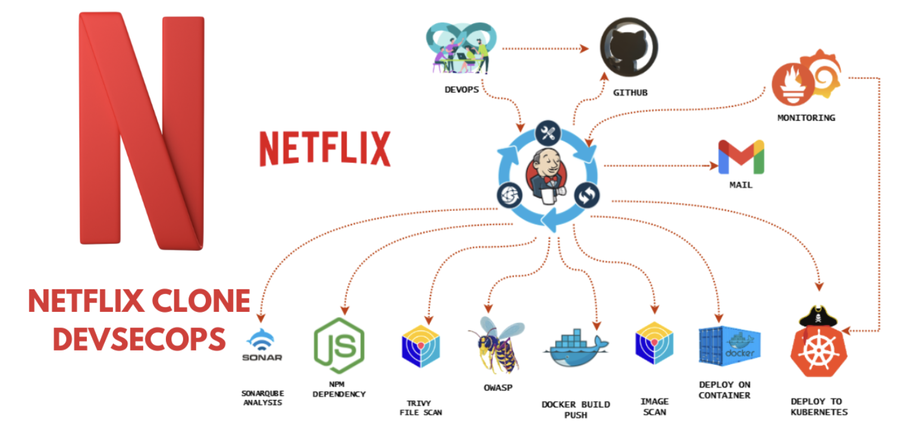

<div align="center">
  <a href="http://netflix-clone-with-tmdb-using-react-mui.vercel.app/">
    
  </a>

  <h3 align="center">Netflix Clone</h3>

</div>

<br />

<div align="center">
  
  
  <p align="center">Home Page</p>
  
  <p align="center">Mini Portal</p>
  
  <p align="center">Detail Modal</p>
  
  <p align="center">Grid Genre Page</p>
  
  <p align="center">Watch Page with customer contol bar</p>
</div>

# Netflix Clone - Complete DevOps Pipeline

A production-ready Netflix clone application with comprehensive CI/CD automation, security scanning, and monitoring implementation.

## 🎯 Project Overview

This project demonstrates enterprise-level DevOps practices by implementing a complete CI/CD pipeline for a Netflix clone application. The focus is on automation, security, and monitoring throughout the entire software delivery lifecycle.

**Key Achievements:**
- Fully automated CI/CD pipeline using Jenkins
- Multi-layer security scanning and vulnerability assessment
- Container orchestration with Kubernetes
- Real-time monitoring and alerting
- Zero-downtime deployments

## 🛠️ Technology Stack

| Category | Technologies |
|----------|--------------|
| **Application** | Node.js 16, JavaScript, HTML, CSS |
| **CI/CD** | Jenkins, GitHub |
| **Code Quality** | SonarQube |
| **Security** | OWASP Dependency Check, Trivy Scanner |
| **Containerization** | Docker, Docker Hub |
| **Orchestration** | Kubernetes |
| **Monitoring** | Prometheus, Grafana |
| **Runtime** | JDK 17 |

## 📋 Pipeline Architecture

The Jenkins pipeline implements the following stages:

### 🔄 CI/CD Flow
```
Code Push → Jenkins Trigger → Security Scans → Build → Test → Deploy → Monitor
```

### 📊 Pipeline Stages

1. **Workspace Preparation**
   - Clean workspace for fresh builds
   - Environment setup with JDK 17 and Node.js 16

2. **Source Code Management**
   - Git checkout from main branch
   - Code synchronization

3. **Code Quality Analysis**
   - SonarQube static code analysis
   - Quality gate validation
   - Code coverage and technical debt assessment

4. **Dependency Management**
   - NPM package installation
   - Dependency resolution and caching

5. **Security Vulnerability Assessment**
   - OWASP Dependency Check for known vulnerabilities
   - Trivy filesystem scanning
   - Security report generation

6. **Containerization**
   - Docker image build with TMDB API integration
   - Image tagging and registry push
   - Trivy container image security scan

7. **Multi-Environment Deployment**
   - Docker container deployment (Port 8081)
   - Kubernetes cluster deployment
   - Service mesh configuration

8. **Notification & Reporting**
   - Email notifications with build status
   - Security scan report attachments

## 🔐 Security Implementation

### Multi-Layer Security Strategy

**Static Analysis**
- SonarQube integration for code quality and security issues
- Quality gates preventing vulnerable code deployment

**Dependency Security**
- OWASP Dependency Check for third-party vulnerabilities
- Automated vulnerability database updates

**Container Security**
- Trivy scanning for OS and application vulnerabilities
- Pre-deployment and post-build security validation

**Runtime Security**
- Kubernetes security contexts
- Network policies and access controls

## 🐳 Docker Configuration

```bash
# Build with API key injection
docker build --build-arg TMDB_V3_API_KEY=*** -t netflix .

# Tag for registry
docker tag netflix abhishek365/netflix:latest

# Push to Docker Hub
docker push abhishek365/netflix:latest

# Run container
docker run -d --name netflix -p 8081:80 abhishek365/netflix:latest
```

## ☸️ Kubernetes Deployment

The application is deployed to Kubernetes using:

- **Deployment manifest:** Handles pod creation and scaling
- **Service manifest:** Manages load balancing and service discovery
- **Automated kubectl operations:** Jenkins manages all Kubernetes interactions

```yaml
# Kubernetes resources applied:
kubectl apply -f deployment.yml
kubectl apply -f service.yml
```

## 📈 Monitoring & Observability

### Prometheus Metrics Collection
- **Jenkins Pipeline Metrics:** Build duration, success rates, failure analysis
- **System Metrics:** CPU, memory, disk I/O monitoring
- **Kubernetes Metrics:** Pod health, resource utilization, cluster status

### Grafana Visualization
- Real-time dashboard for infrastructure monitoring
- Application performance metrics
- Custom alerts and notification rules
- Historical trend analysis

### Monitored Components
- Jenkins build server performance
- Application container health
- Kubernetes cluster and pod metrics
- System resource utilization

## 📧 Automated Notifications

**Email Integration:**
- Build status notifications (success/failure)
- Detailed build information and logs
- Security scan reports attached
- Build artifacts and deployment status

## 🚀 Quick Start

### Prerequisites
- Jenkins server with required plugins
- SonarQube server
- Docker and Docker Hub access
- Kubernetes cluster
- Prometheus and Grafana setup
- TMDB API key

### Setup Instructions

1. **Clone Repository**
   ```bash
   git clone <your-repository-url>
   cd netflix-clone
   ```

2. **Configure Jenkins**
   - Install required tools (JDK 17, Node.js 16, SonarQube Scanner)
   - Set up credentials for Docker Hub, SonarQube, and Kubernetes
   - Configure email notifications

3. **Pipeline Execution**
   - Create Jenkins pipeline job
   - Use the provided Jenkinsfile
   - Configure webhook triggers

4. **Access Application**
   - Docker: `http://localhost:8081`
   - Kubernetes: Via configured service endpoints

## 📊 Pipeline Reports

The automation generates comprehensive reports:

- **SonarQube Dashboard:** Code quality metrics and security findings
- **OWASP Reports:** Dependency vulnerability assessments
- **Trivy Scans:** Filesystem and container security reports
- **Build Artifacts:** Automated archival in Jenkins

## 🎬 Application Features

- Browse trending movies and TV shows
- Search functionality
- Responsive design
- Real-time data from TMDB API
- Production-ready performance

## 📈 Benefits Achieved

✅ **Automated Quality Assurance:** Every code change is automatically tested and validated  
✅ **Enhanced Security:** Multi-layer vulnerability detection and prevention  
✅ **Scalable Deployment:** Kubernetes orchestration with monitoring  
✅ **Real-time Visibility:** Comprehensive monitoring and alerting  
✅ **Reduced Manual Effort:** Complete automation from code to production  
✅ **Industry Best Practices:** Production-ready DevOps implementation  

## 🔮 Future Enhancements

- Automated testing integration (Unit, Integration, E2E)
- Blue-green deployment strategy
- Multi-cloud deployment support
- Advanced security policies with OPA
- Service mesh integration (Istio)

## 🙏 Acknowledgments

- **Original Netflix Clone:** Based on Netflix interface design
- **DevOps Implementation:** Complete CI/CD, security, and monitoring setup
- **Community Tools:** Open source tools that made this automation possible

---

**⭐ Star this repository if it helps you learn DevOps!**

**🔗 Connect:** [LinkedIn](https://www.linkedin.com/in/abhishek-jha-abhi16/) | [Portfolio](your-portfolio) | [Email](abhishek1607jha@gmail.com)

---

*Built with ❤️ for the DevOps community*
- Add Tests.
